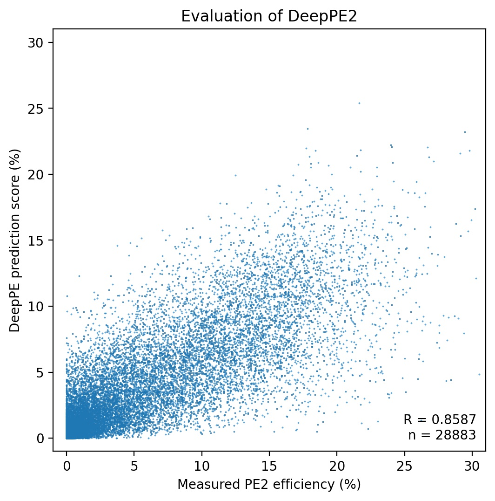
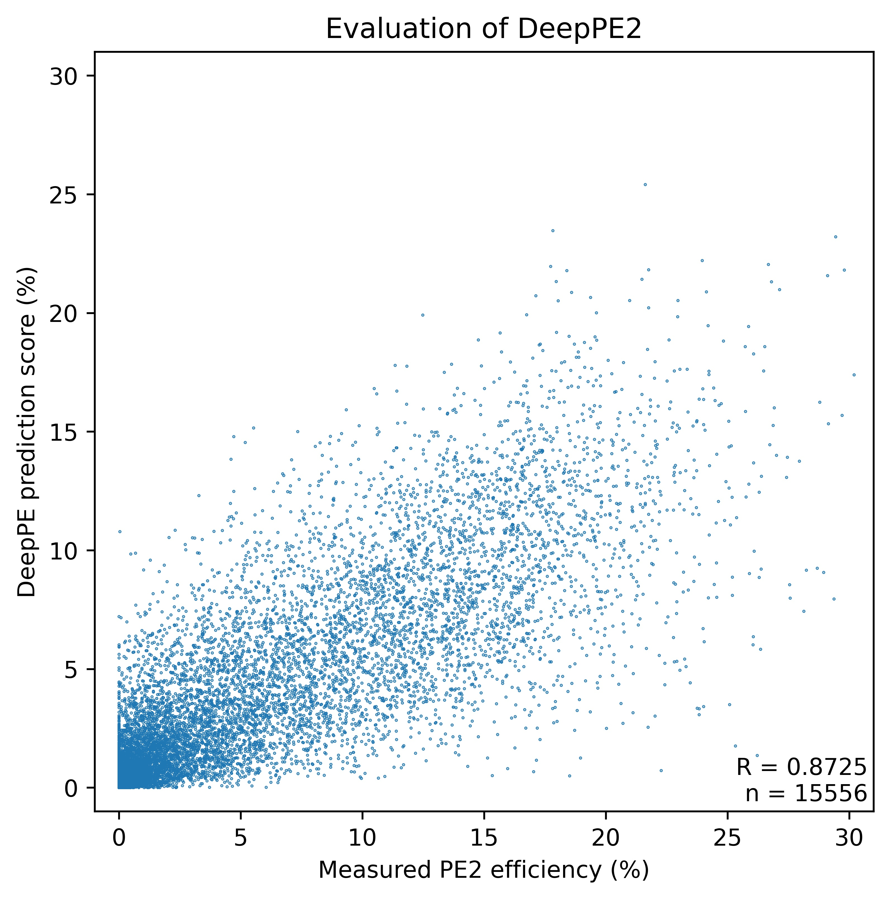
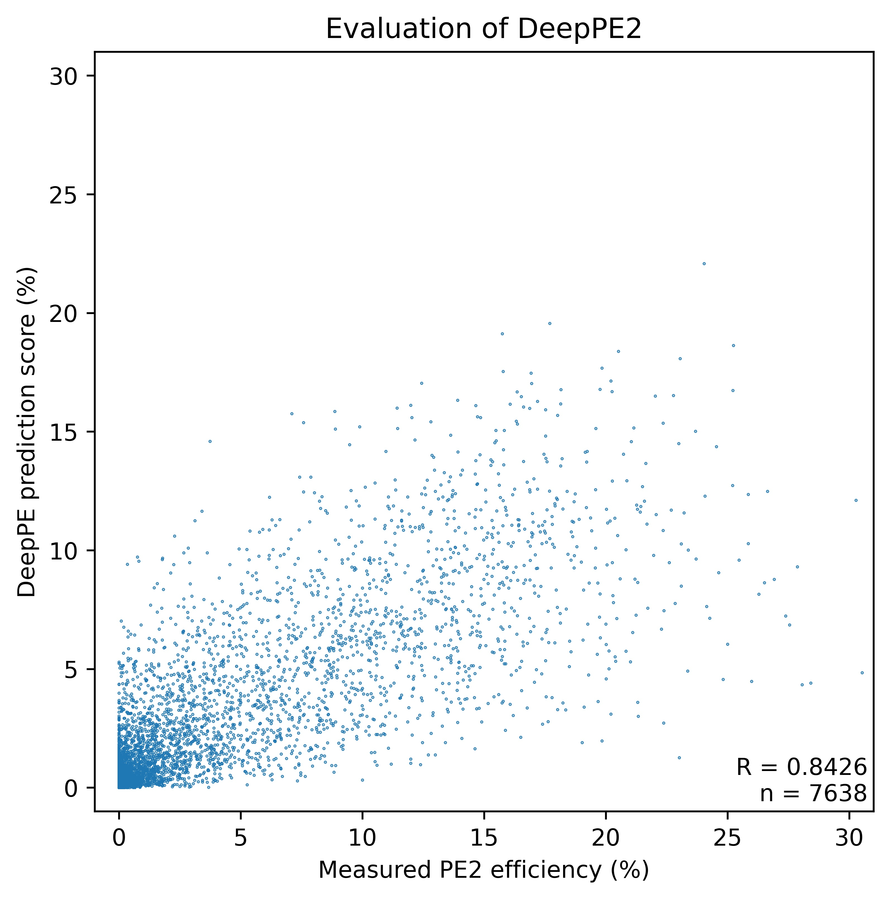
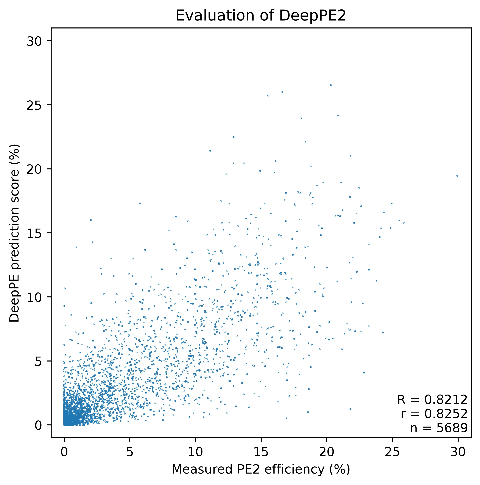

## Predicting the efficiency of CRISPR-based prime editing.

### Currently working on:
* Improving [DeepPE](http://deepcrispr.info/DeepPE/) using a Conv2D-RNN-based model.
* Fine-tuning using a biased external data that tested various pegRNA combinations
### Current model performance
**DeepPE2 performance plot**

**Prediction for substitution only**

**Prediction for insertion only**

**Prediction for deletion only**

